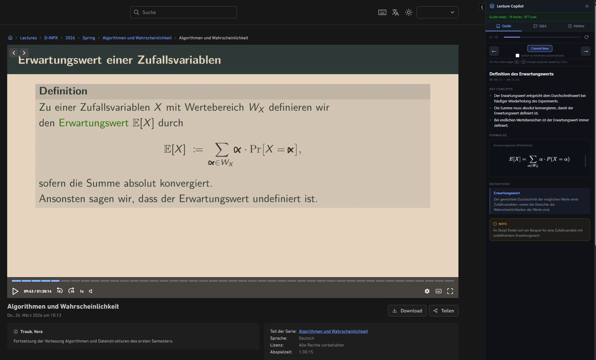
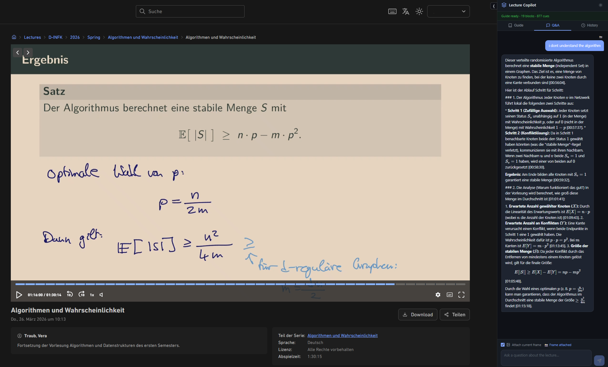
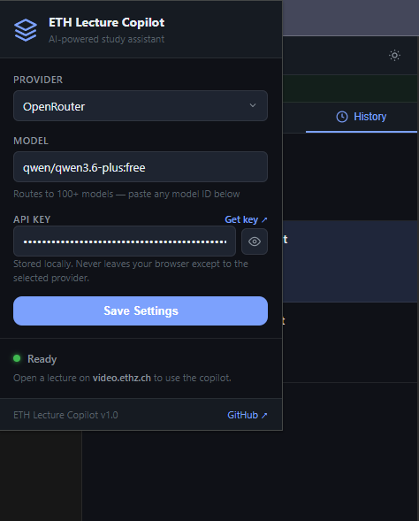

# ETH Lecture Copilot

<p align="center"><strong>Chrome extension</strong>: AI study guides and Q&amp;A for ETH Zürich lectures on <a href="https://video.ethz.ch">video.ethz.ch</a> (transcript sync, KaTeX, optional frame context).</p>

Repository: [github.com/krol05/eth-lecture-copilot](https://github.com/krol05/eth-lecture-copilot)

A Chrome extension that turns ETH Zürich lecture recordings into structured study guides using AI. It sits as a sidebar next to the video on [video.ethz.ch](https://video.ethz.ch) and generates a topic-by-topic breakdown of the lecture, synced to the current timestamp as you watch.

## Screenshots

<table>
  <tr>
    <td align="center" width="50%">
      <strong>Guide + lecture</strong><br />
      <sub>Structured guide (concepts, definitions, formulas) stays aligned with playback.</sub><br /><br />
      
    </td>
    <td align="center" width="50%">
      <strong>Q&amp;A with frame attached</strong><br />
      <sub>The <strong>second</strong> image is the Q&amp;A tab: the model answered using <strong>Attach current frame</strong> so the slide is included as context.</sub><br /><br />
      
    </td>
  </tr>
  <tr>
    <td colspan="2" align="center">
      <br /><strong>Settings</strong><br />
      <sub>Choose provider, model, and API key. Everything stays in your browser.</sub><br /><br />
      
    </td>
  </tr>
</table>

## Features

### Guide generation

- **Transcript**: auto-extracted from the lecture page, or paste manually if needed.
- **Structured JSON guide**: key concepts, definitions, formulas (KaTeX), notes, per topic with time ranges.
- **Block detail** and **block count**: two independent levels (low to very high). Controls how dense each section is and how many blocks the model should aim for. Output token budget scales with the combination.
- **Language**: choose a common language (including Swiss national languages and several widely used languages), “same as transcript”, or **Other** with a custom language name. All guide text follows that language; JSON structure and LaTeX stay valid.
- **Temperature** and **thinking** (where the provider supports it): Anthropic extended thinking, Gemini thinking budget, OpenAI o-series reasoning effort, OpenAI-compatible temperature.
- **Safe defaults**: optional checkbox to ignore custom sliders and use conservative generation settings.
- **Info banner**: reminds you that results depend on the model, context window, and your settings, and that tuning may take trial and error.

### Playback and layout

- **Time sync**: the guide can follow the video. **Arrow keys** on the previous or next section temporarily pause auto-follow while the checkbox stays on; use **Current time** to resume following playback.
- **Focus mode**: header button to show only the video area and the sidebar (useful when the normal layout feels cramped).
- **Keyboard**: **Arrow Up / Down** on the video page (when not typing in an input) changes playback speed by 0.25x. A short on-screen overlay shows the current speed.
- **UI settings page**: open via the settings cog in popup and sidebar. Customize sidebar scale and full dark or light color schemes, with restore defaults buttons and a warning that extreme values can cause layout issues.

### Q&amp;A

- Full **transcript + guide** as context for each answer.
- **Temperature** control for chat.
- **Attach current frame** (vision models): sends a snapshot of the video. A hint notes that only **multimodal** models support images; check your provider.
- **Course scripts (optional PDFs)**: upload one or more PDFs per **course** (keyed by lecture or course id in the URL, year-agnostic). Text is extracted in the browser, **chunked**, and indexed locally (**IndexedDB**). Each question runs **BM25-style** retrieval so only relevant chunks are added to the prompt. **Script reliance** (low to strict) controls how many chunks and how strongly the model should follow the script vs the lecture. Large scripts can increase tokens per message; the UI explains chunking and token impact.

### History and export

- **History** of generated guides per lecture; load a past guide or delete entries (except the active lecture’s entry from the list in some cases).
- **Export guide as PDF**: builds a print-ready HTML page with **KaTeX** already rendered, opens the system print dialog. Use **Save as PDF**. Available from the **Guide** toolbar (current guide) and from each **History** row.

### Providers

- **Cloud**: Google Gemini, OpenAI, Anthropic, xAI, DeepSeek, Mistral, OpenRouter, Groq, Together AI, Cerebras, and similar OpenAI-compatible endpoints.
- **Local**: Ollama, LM Studio, Jan, **LiteLLM** (or any OpenAI-compatible base URL). Model discovery uses `GET /v1/models` where available.

API keys and local base URLs are stored in the extension; requests go from your browser to the provider (or your local proxy), not through a custom backend.

## Supported AI providers

Works with most major providers. Pick one in the popup, paste your API key (or set a local base URL), and choose a model:

- Google Gemini (free tier via [AI Studio](https://aistudio.google.com/app/apikey))
- OpenAI, Anthropic, xAI, DeepSeek, Mistral
- OpenRouter, Groq, Together AI, Cerebras
- Local models (Ollama, LM Studio, Jan, LiteLLM proxy, or any OpenAI-compatible server)

### Suggested providers and models

- **[Google AI Studio](https://aistudio.google.com/app/apikey)** is a practical default: the free tier includes a generous daily allowance for trying the extension.
- In experiments with this project, **Gemini 2.5 Flash** has performed well for guide quality, math-heavy lectures, and follow-up Q&amp;A.
- **[OpenRouter](https://openrouter.ai/)** is a strong option for a broad catalog of models, including some free endpoints. Pick a model on their site and paste its ID into the extension.

**Multimodal models and “Attach current frame”:** Not every model accepts images. **Attach current frame** sends an image of the current video frame. Use **vision-capable** models. Text-only models may ignore or fail image parts.

## Installation

1. Clone or download this repo: `git clone https://github.com/krol05/eth-lecture-copilot.git`
2. Open `chrome://extensions` in Chrome (or another Chromium browser)
3. Enable **Developer mode** (top right)
4. Click **Load unpacked** and select the `eth-lecture-copilot` folder
5. Open any lecture on [video.ethz.ch](https://video.ethz.ch). The sidebar appears automatically
6. Click the extension icon to set provider, model, and API key

## Usage

1. Open a lecture on video.ethz.ch
2. Wait for the transcript (or paste it)
3. Adjust guide options if you want, then **Generate Guide**
4. Use the Guide tab while watching; optional **Focus mode**, navigation, and **Current time**
5. Use **Q&amp;A** for questions; optional PDF scripts and **Attach current frame**
6. Open **History** to reload past guides or **PDF** export per entry

If transcript detection fails for a lecture, use manual paste.

## Project structure

```
├── background/        Service worker: AI API calls, guide parsing
├── content/           Content script + CSS on video.ethz.ch
├── sidebar/           Sidebar UI, scripts (PDF chunking, BM25), print export
├── popup/             Extension popup for settings
├── lib/               Providers config, KaTeX, pdf.js (PDF text extraction)
├── icons/             Extension icons
├── docs/images/       README screenshots
├── .github/           e.g. REPO_DESCRIPTION.txt for GitHub About
└── manifest.json
```

## Notes

- Personal project, not affiliated with ETH Zürich.
- API calls go from the extension straight to the provider (or localhost). No project server sees your keys or lecture content.
- Works on Chrome, Edge, Brave, Arc, and other Chromium-based browsers.
