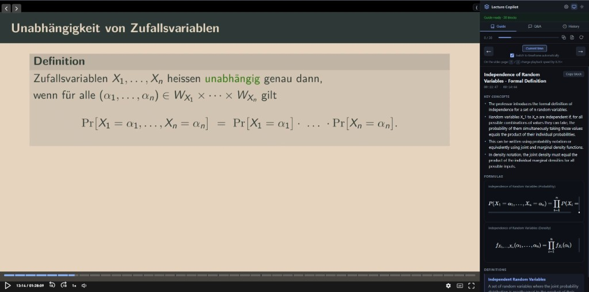
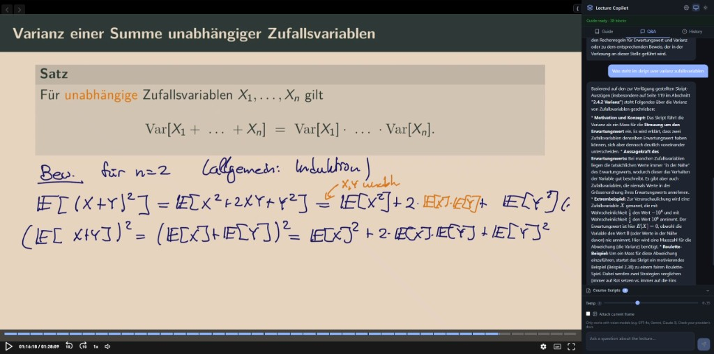
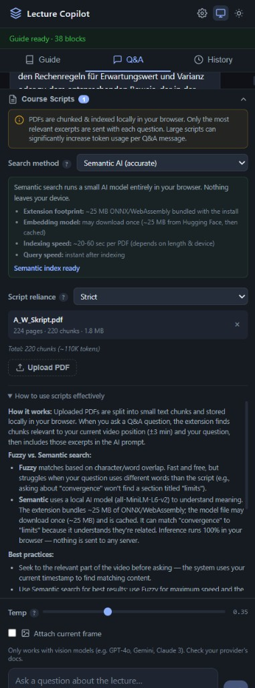
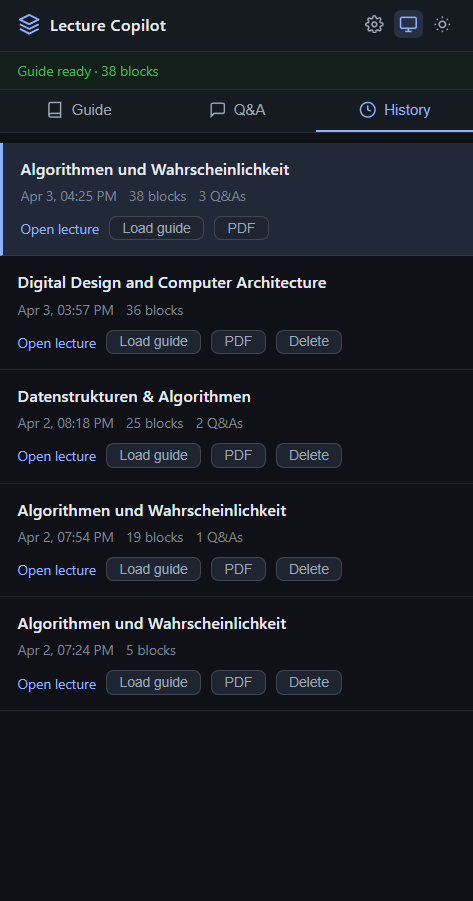
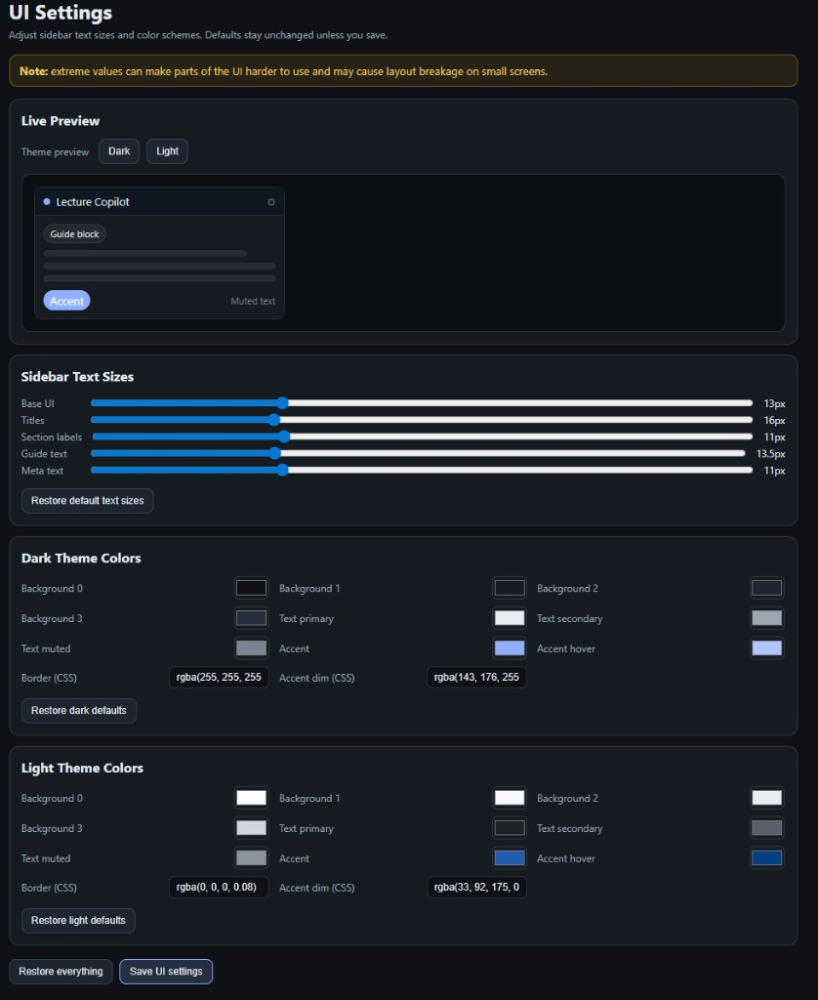
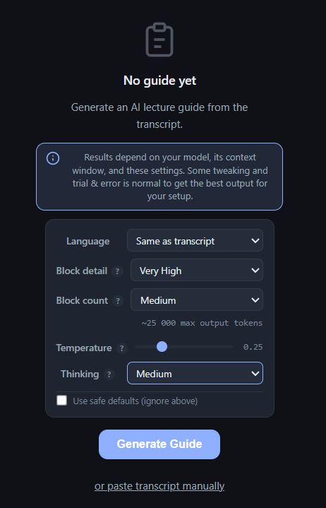
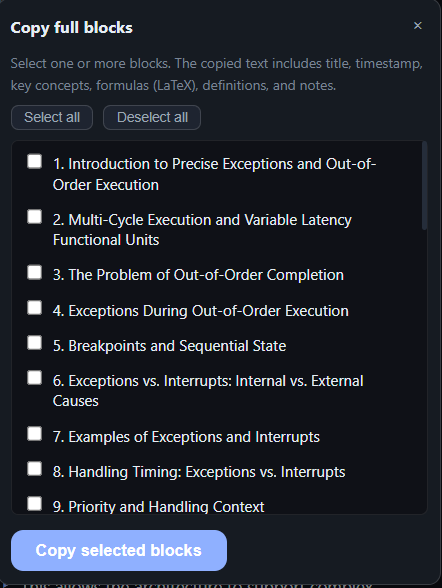
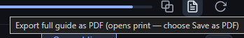
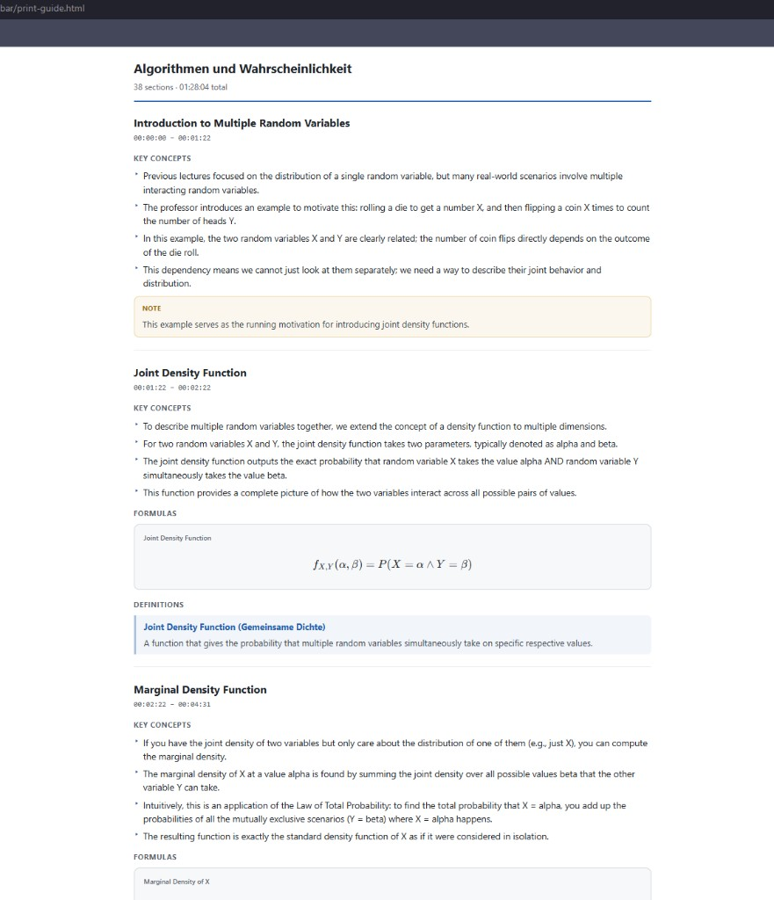
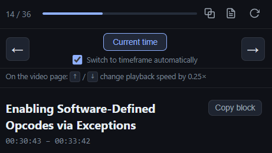

# ETH Lecture Copilot

**Chrome extension:** AI study guides and Q&amp;A for ETH Zürich lectures on [video.ethz.ch](https://video.ethz.ch). The sidebar stays next to the video: transcript sync, structured guides with KaTeX math, optional vision (current frame), optional course PDF scripts with local search, history, and PDF export.

**Repository:** [github.com/krol05/eth-lecture-copilot](https://github.com/krol05/eth-lecture-copilot)

---

## Table of contents

1. [Overview](#overview)
2. [Screenshots](#screenshots)
3. [Features](#features)
4. [Usage guide](#usage-guide)
5. [Course scripts (PDFs)](#course-scripts-pdfs)
6. [Supported providers and models](#supported-providers-and-models)
7. [Installation](#installation)
8. [Project structure](#project-structure)
9. [Privacy and notes](#privacy-and-notes)

---

## Overview

ETH Lecture Copilot injects a sidebar into lecture pages on **video.ethz.ch**. It reads the page transcript (or accepts a manual paste), calls **your** AI provider from the browser, and builds a **time-stamped study guide** split into blocks. While you watch, the guide can follow playback or you can browse sections manually. A **Q&amp;A** tab answers questions using the transcript, the guide, optional **uploaded course scripts**, and optionally a **snapshot of the current video frame** for vision models.

---

## Screenshots

Each image is described so you know what you are looking at in the repo or on GitHub.

### Guide tab: structured blocks next to the lecture



**Figure 1.** The **Guide** tab with a generated guide (here: 30 blocks). The current block matches the lecture segment (timestamp range under the title). Content includes **Key concepts**, **Formulas** rendered with KaTeX, and **Definitions**. Use **Copy block** for a single section. The header shows status (for example, "Guide ready") and tabs for Guide, Q&amp;A, and History.

### Q&amp;A tab: questions with course scripts and vision options



**Figure 2.** The **Q&amp;A** tab. The user asked about content from the course script; the answer references that material. Below the chat: **Course Scripts** (collapsed header in this crop), **Temp** for answer creativity, and **Attach current frame** for models that accept images. The hint reminds you to use **vision-capable** models if you attach a frame.

### Course Scripts: search method, script reliance, and help



**Figure 3.** Expanded **Course Scripts** in Q&amp;A: warning about chunking and tokens, **Search method** (here **Semantic AI**), the semantic info panel (local model, bundled ONNX footprint, embedding model download, indexing time), **Script reliance**, uploaded PDFs with chunk counts, and the **How to use scripts effectively** section (scrollable inside the sidebar).

### History: past lectures and actions



**Figure 4.** The **History** tab lists saved sessions with title, date, block count, and Q&amp;A count. Per row: **Open lecture**, **Load guide**, **PDF** export, and **Delete** where applicable. Use this to reopen a guide without regenerating.

### UI Settings: themes, text sizes, and colors



**Figure 5.** **UI Settings** (cog in the sidebar or popup): **Live preview** for dark or light theme, **Sidebar text sizes** (base, titles, labels, guide body, meta), **Dark theme colors** and **Light theme colors** with pickers and optional CSS fields. **Save UI settings** persists choices. Extreme values may crowd the layout on narrow sidebars.

### Guide generation: options before the first run



**Figure 6.** The **No guide yet** state: blue info banner, **Language**, **Block detail**, **Block count** (with a token hint), **Temperature**, **Thinking** (with a dynamic tooltip that depends on your provider and model), **Use safe defaults**, **Generate Guide**, and **paste transcript manually**.

### Copy full blocks: export multiple sections at once



**Figure 7.** **Copy full blocks** opens from the Guide toolbar. Select sections; the clipboard gets titles, timestamps, key concepts, formulas (LaTeX source where applicable), definitions, and notes for each selected block.

### Export full guide as PDF (print flow)



**Figure 8.** The **Export** icon on the Guide toolbar. The tooltip explains that a print tab opens and you choose **Save as PDF** in the system print dialog.

### Print view: printable study guide in the browser



**Figure 9.** The **print-guide** page: full guide title, total sections and duration, then each block with headings, times, notes, **FORMULAS**, and **DEFINITIONS** in a layout suited for printing or saving as PDF.

### Guide navigation: blocks, time sync, and shortcuts



**Figure 10.** Block index (for example **14 / 36**), **Copy** and **Export** and **Regenerate** actions, **Previous** / **Next** section, **Current time** to jump to the block for the current playback time, and **Switch to timeline automatically** (auto-follow). The hint line documents **Arrow Up / Down** on the video page to change playback speed by **0.25×**.

---

## Features

### Guide generation

- **Transcript:** Extracted automatically from the lecture page when possible, or paste manually.
- **Structured guide:** JSON-shaped content with per-block time ranges, key concepts, definitions, formulas (KaTeX), and notes.
- **Block detail** and **Block count:** Independent controls from low to very high. Together they shape how dense each block is and how many blocks the model targets. A token hint reflects the combined cost.
- **Language:** Presets (including Swiss national languages), **Same as transcript**, or **Other** with a custom name. Guide prose follows your choice; structure and LaTeX stay valid.
- **Temperature** and **Thinking:** Sent to the provider when supported. The **Thinking** tooltip updates from your saved provider and model (Anthropic extended thinking, Gemini thinking budget, OpenAI **o**-series reasoning effort, or explains when thinking levels are not sent for OpenAI-compatible APIs).
- **Safe defaults:** Optional checkbox to ignore the sliders and use conservative built-in values.
- **Info banner:** Reminds you that quality depends on the model, context window, and your settings.

### Playback and layout

- **Time sync:** The guide can follow the video. If you move with **Previous** / **Next**, auto-follow pauses until you align with the live block again (by navigation or as the video catches up) or tap **Current time**.
- **Focus mode:** Header control to emphasize the video and sidebar.
- **Keyboard:** On the video page (when focus is not in a text field), **Arrow Up** / **Arrow Down** changes playback speed in **0.25×** steps; a short overlay shows the current speed.
- **UI settings:** Sidebar text sizes, dark or light theme, and detailed color tokens, with live preview and restore defaults.

### Q&amp;A

- Uses **transcript**, **guide**, and your **question**. Optional **Course scripts** add retrieved PDF excerpts. Context is **time-aware:** a window around the current playback time plus your question drives retrieval so prompts stay efficient.
- **Temperature** for answer style.
- **Attach current frame:** Sends a JPEG snapshot for **multimodal** models. Text-only models may ignore or error on images.

### Course scripts (PDFs)

- Upload PDFs **per course** (derived from the lecture URL). Text is extracted in the browser with **pdf.js**, chunked, and stored in **IndexedDB**.
- **Search method:**
  - **Fuzzy (fast):** Character or word similarity, no ML, instant.
  - **Semantic AI:** Local **Transformers.js** embeddings (**all-MiniLM-L6-v2**). The extension bundles ONNX **WebAssembly** (CSP allows `wasm-unsafe-eval` for instantiation). The embedding model may download once from Hugging Face and is cached. Indexing a PDF can take on the order of tens of seconds depending on length and device.
- **Script reliance:** From light reference to **strict**, controlling how many chunks are injected and how strongly answers should follow the script.

### History and export

- **History** of guides per lecture: load, open the source page, export **PDF**, delete.
- **Export guide as PDF:** Opens a print-ready page with KaTeX already rendered; use the browser **Save as PDF** action.

### Providers

- **Cloud:** Google Gemini, OpenAI, Anthropic, xAI, DeepSeek, Mistral, OpenRouter, Groq, Together AI, Cerebras, and other OpenAI-compatible HTTPS APIs.
- **Local:** Ollama, LM Studio, Jan, **LiteLLM**, or any server that speaks OpenAI **Chat Completions** (base URL in settings).

API keys and local base URLs stay in the extension. Requests go from your browser to the provider or localhost, not through a project-hosted backend.

---

## Usage guide

### First-time setup

1. **Install** the extension (see [Installation](#installation)).
2. Click the extension **icon** and open **Options** or use the popup to choose **provider**, **model**, and **API key** (or local base URL).
3. Open **UI settings** from the cog if you want to tune fonts and colors.

### Every lecture

1. Open a recording on **video.ethz.ch**. Wait until the sidebar reports transcript readiness (or use manual paste from the generate panel).
2. Set **Language**, **Block detail**, **Block count**, **Temperature**, and **Thinking** as needed, then **Generate Guide**. Large lectures can take minutes; the status line shows progress.
3. On the **Guide** tab, use **Previous** / **Next** or let **Switch to timeline automatically** follow the video. **Current time** jumps to the block for the playhead.
4. Use **Copy block**, **Copy full blocks**, or **Export** (print to PDF) to take notes offline.
5. On **Q&amp;A**, ask questions. Expand **Course Scripts** to upload PDFs and pick **Fuzzy** or **Semantic** search and **Script reliance**.
6. Optionally enable **Attach current frame** if your model supports vision.
7. Use **History** to return to older guides or export them.

### If something fails

- **No transcript:** Use **paste transcript manually** from the generate area.
- **Images in Q&amp;A:** Confirm the model is **multimodal** and that **Attach current frame** is appropriate.
- **Semantic indexing errors:** Reload the extension after updates; confirm the manifest loads (bundled WASM and CSP). **Fuzzy** search works without embeddings.

---

## Course scripts (PDFs)

- Scripts are **local only** until you send a question: only **retrieved chunks** go into the AI prompt, not the whole PDF each time.
- Prefer **Semantic** when wording in questions differs from the PDF; prefer **Fuzzy** for speed and minimal resource use.
- Seek to a relevant part of the video before asking so the timestamp window matches your intent.

---

## Supported providers and models

Works with most major providers. Configure the popup or options page:

- **Google Gemini** (free tier via [AI Studio](https://aistudio.google.com/app/apikey))
- **OpenAI**, **Anthropic**, **xAI**, **DeepSeek**, **Mistral**
- **OpenRouter**, **Groq**, **Together AI**, **Cerebras**
- **Local** stacks: Ollama, LM Studio, Jan, LiteLLM, or custom OpenAI-compatible URLs

**Suggestions**

- Google AI Studio is an easy way to try the extension on the free tier.
- In testing, **Gemini 2.5 Flash** has worked well for guides, math-heavy courses, and follow-up Q&amp;A.
- **OpenRouter** offers a wide catalog, including some free models; copy the model id from their site into the extension.

**Vision:** For **Attach current frame**, pick a **vision-capable** model. Plain text models may not handle images.

---

## Installation

1. Clone or download: `git clone https://github.com/krol05/eth-lecture-copilot.git`
2. Open `chrome://extensions` in Chrome or another Chromium browser
3. Enable **Developer mode**
4. Click **Load unpacked** and select the `eth-lecture-copilot` folder inside the repo
5. Open a lecture on [video.ethz.ch](https://video.ethz.ch); the sidebar should appear
6. Click the extension icon and set provider, model, and API key (or local URL)

---

## Project structure

```
├── background/           Service worker: AI calls, guide JSON parsing
├── content/              Injects sidebar, video layout, transcript hooks
├── sidebar/              Guide UI, Q&A, scripts (PDF, fuzzy + semantic), print export
├── popup/                Quick provider or model entry
├── ui/                   Options and UI settings pages
├── lib/                  Providers config, KaTeX, pdf.js, Transformers.js + ONNX assets
├── icons/
├── docs/images/          README screenshots
├── .github/
└── manifest.json
```

---

## Privacy and notes

- **Not affiliated** with ETH Zürich. Personal project.
- **API calls** originate in your browser to the provider or your machine. This project does not operate a server that sees your keys or lecture text.
- **Course scripts** are processed locally; only selected chunks are included in prompts you send to the AI.
- Works in Chrome, Edge, Brave, Arc, and other Chromium browsers that support Manifest V3 extensions.
